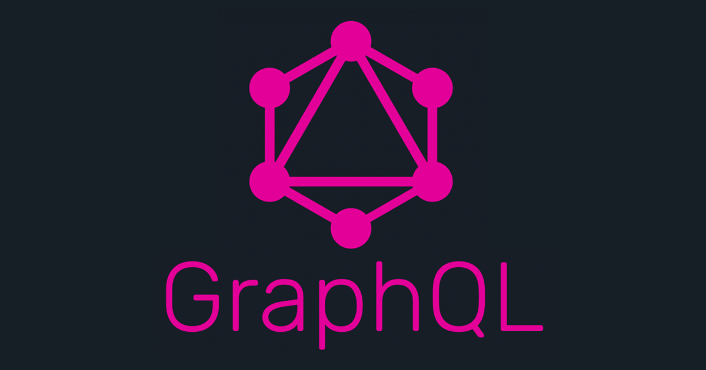

# GraphQL security 101

GraphQL is quickly becoming the alternative to REST API, being able to request a specified set of data across multiple resources within a single request. But with great power come great security risks. A single point of failure could allow attackers to create complex queries and exhaust resources (DoS), or bypass authorization to retrieve unauthorized information. This hands-on workhop is a prefect match boost your GraphQL skills, and be able to exploit the wrong implementation of the framework.

## GraphQL security workshop 

The workshop is meant for developers, architects and security folks. During the workshop we will learn how to setup a GraphQL project, define a schema, create Query, Mutation and Subscription for a "fake" social network. We will learn what are the main security issues to consider when developing a GraphQL application:

-	Introspection: information disclosure
-	/graphql as a single point of failure (DoS attacks)
-	IDOR
-  Broken Access control 
-  Injections 

Once we get familiar with the issues, we will explain how to avoid it and/or fix it.

## Presented at

|  | https://www.devseccon.com/seattle-2019/ |
|-----------------------------------------------------------------------------------------------------------------------|------------|

#Contact us

> Interested in learning more?
>
> Contact us @ info@dcodx.com 
